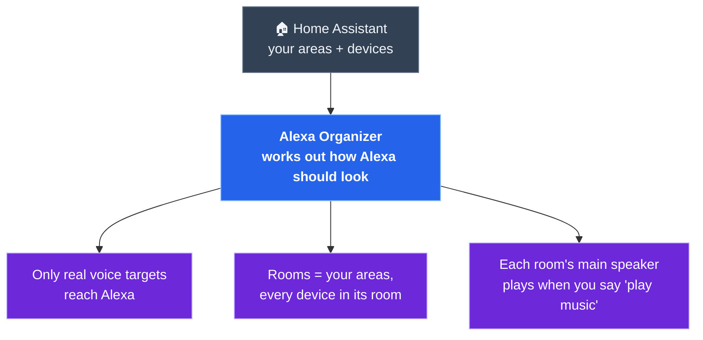

# Alexa Organizer

**Your house, in Alexa.** — one review, one tap, and Alexa matches Home Assistant.

Alexa Organizer makes **Home Assistant the source of truth for Alexa**. It looks at your
areas and devices, works out how Alexa *should* look — which devices it sees, which rooms
exist, what's in each room, which speaker plays music — and shows you the difference. Review
it, hit **Sync**, done. No more afternoons in the Alexa app dragging devices around, deleting
"Media Room 3", or wondering why "turn on the office" stopped working.

- **Home-Assistant-first.** Your areas become Alexa's rooms; every device lands in its room.
  Rename or rearrange in HA, and Alexa follows on the next sync.
- **Opinionated, so you don't have to be.** Only real voice targets reach Alexa — lights,
  speakers, climate, scenes, covers, fans. Sensors, buttons, and config toggles never do.
- **One device, one row.** An Echo or Sonos that Home Assistant *also* sends to Alexa shows
  up once, and moving or removing it takes every copy along.
- **Speakers that play where you are.** Pick each room's main speaker — Echo or Sonos — and
  "play music" in that room plays there.
- **Staged, not surprising.** Arrange freely; nothing changes in Alexa until you review the
  plan and hit **Sync**. Nothing runs in the background.

**Install:** HACS → ⋮ → *Custom repositories* → add this repo as an **Integration** →
Download → restart Home Assistant → add the **Alexa Organizer** integration.
([full steps ↓](#install-hacs-custom-repository))

> **Beta.** This runs on one real house so far and is looking for testers. The room and
> speaker features use Alexa's private API — read [the heads-up](#heads-up) before you sync.
> A sibling to [Chorus](https://github.com/willblaschko/chorus).

## The idea

---

## Status

**Working on a real house; ready for testers.**

- ✅ **Exposure** — a rules-based policy decides what Alexa sees; HA labels handle the
  exceptions. New entities are never auto-exposed.
- ✅ **Rooms** — HA areas become Alexa rooms: missing rooms created, near-misses renamed,
  Alexa's churn duplicates ("Media Room 2", "Media Room 3") folded into one, empty ghost
  rooms deleted.
- ✅ **Placement** — every device lands in its area's room; move anything from its row.
- ✅ **Speakers** — set each room's main speaker (Echo, or Sonos via the Sonos skill) so a
  plain "play music" plays there.
- ✅ **One device, one row** — an Echo and its Home Assistant copy are joined by serial
  number, so actions hit both and renames don't split them.
- ✅ **Echo rename on move** — move an Echo and it can take its new room's name.
- ✅ **Cleanup** — remove old phone-app registrations, duplicates, and strays from Alexa.
- 🧪 **Needs testers** — houses that aren't mine: other Echo models, non-Sonos speakers,
  bigger setups, Alexa accounts outside the US.

---

## Why it exists

Home Assistant's Alexa integration exposes **entities**, one by one. Alexa thinks in
**rooms** — and there's no official API to manage them, so keeping the two in sync means
doing it by hand in the Alexa app, forever. Meanwhile it drifts: speakers get re-discovered
as "Media Room 2", devices fall out of their rooms, Home Assistant sends Alexa a second copy
of every Echo it already has, and a thousand sensors wait to flood the device list.

Alexa Organizer takes a stance on all of it and keeps it that way — while showing you exactly
what it's about to do first.

---

## Features

### The Home screen

- **One status line** — *"Alexa matches your house"*, or *"12 changes to make Alexa match
  your house"* with a **Review & Sync** button.
- **Your house, as Alexa will see it** — rooms and their devices, showing the result *after*
  your changes, grouped by kind (Lighting, Speakers, Climate, …).
- **Review, then sync** — a grouped, plain-language change list with a checkbox per change.
  Sync runs it in the right order (rooms before the devices that go in them, deletions
  last), with a status mark on every step.

### What Alexa sees

- **Rules, not lists** — lights and switches that live in an area, speakers, climate,
  scenes, covers, fans, and vacuums are exposed; everything else isn't.
- **Labels for the exceptions** — tag an entity `alexa` to force it in (voice-scene
  scripts), or `alexa-hide` to keep it out. Untick an exposure change in the review and
  Sync pins your choice with the label for you.
- **No duplicate switches** — a switch that just powers an exposed light stays hidden.
- **Nothing leaks in** — Home Assistant's "expose new entities" stays off, and nothing
  changes in the background.

### Rooms & devices

- **Areas → rooms**, including creating a room the moment an area has devices, and fixing
  names that are almost right.
- **Move anything** from its row; the preview shows it in its new room right away.
- **One device, one row** — moving or removing a device takes its Home Assistant copy with
  it. If the two ever end up in different rooms, the plan puts them back together.
- **Echos take their room's name** — move "Kitchen Echo Dot" to the Office and it can become
  "Office Echo Dot" (a checkbox you can untick).
- **Vacuums stay out of rooms**, so "turn on the living room" doesn't start the robot.
- **Your moves stick** — the plan never second-guesses a device you've put in a room.

### Speakers

- **Make main** — pick which speaker answers "play music" in each room. Works with Echos and
  with Sonos (via the Sonos Alexa skill).
- **Always, not just when named** — rooms default to playing on their main speaker for a
  plain "play music", not only when you say the room's name.
- **Honest labels** — each speaker shows who made it. Home Assistant copies (which Alexa
  can't play music to) stay out of the way.

### Cleanup & safety

- **Remove** any device from its row — Amazon devices are deregistered, strays are
  forgotten, Home Assistant devices just stop being sent to Alexa.
- **Protected** — "This Device" (the phone you're on), Audible, and the logins this tool
  relies on can never be removed.
- **Suggestions, not surprises** — confident junk (old phone-app registrations, duplicates)
  is pre-checked; anything ambiguous is opt-in.

---

## Heads-up

The **exposure** side uses Home Assistant Cloud's normal Alexa connection. The **rooms,
speakers, and cleanup** side has no official API anywhere, so it uses Alexa's own private
API — the one the Alexa app uses — through your existing Alexa login in Home Assistant.

- **Amazon can change it without notice.** If something stops working after an Amazon
  update, [open an issue](https://github.com/willblaschko/alexa-organizer/issues).
- **It's unofficial** and likely outside Amazon's terms of service. Use it on your own
  account, at your own risk.
- **Changes are real.** There's no undo button for Alexa — review the plan before you sync,
  especially removals.

## Power features & docs

Every action is also a Home Assistant service. Dig in:

- **[Services →](docs/ADVANCED.md#services)** — every action, callable from Developer Tools
  or an automation.
- **[The exposure policy →](docs/ADVANCED.md#the-exposure-policy)** — the full rules, labels,
  and safety guard.
- **[How it works →](docs/ADVANCED.md#how-it-works)** — where the data comes from and how
  devices are matched up.
- **[Troubleshooting →](docs/ADVANCED.md#troubleshooting)** — the usual suspects.

---

## Install (HACS custom repository)

You'll need:

- **Home Assistant Cloud (Nabu Casa)** with Alexa turned on — this is how devices reach Alexa.
- **[Alexa Media Player](https://github.com/alandtse/alexa_media_player)** (recommended) or
  the built-in **[Alexa Devices](https://www.home-assistant.io/integrations/alexa_devices/)**
  integration, logged in — for rooms, speakers, and cleanup. Alexa Media Player also lets
  the organizer match each Echo to its Home Assistant copy exactly.

Then:

1. In **HACS → ⋮ → Custom repositories**, add this repo with category **Integration**.
2. Open **Alexa Organizer** and **Download** it, then **restart Home Assistant**.
3. **Settings → Devices & Services → Add Integration → Alexa Organizer.**

## Use

Open **Alexa Organizer** in the sidebar. Look over your house as Alexa will see it, move or
remove anything that's off, then **Review & Sync** — untick anything you don't want — and
**Sync**. Come back any time something changes in Home Assistant.

### Testing it?

Thank you! The most useful reports:

- **What looked wrong in the plan** before you synced (a device in the wrong room, a rename
  you didn't expect, something suggested for removal that shouldn't be).
- **Anything that failed during Sync** — which step, and the message.
- Your setup: Echo models, speaker brands, rough number of rooms and devices.

→ **[Open an issue](https://github.com/willblaschko/alexa-organizer/issues)**

---

## What's next

- **Per-area light groups** — "turn on the kitchen" hits one group, not six bulbs.
- **Rename any device** from the panel (Echos already follow their room).
- Broader testing, then the **HACS default store**.

---

## How to support

Alexa Organizer is free, and I'm not looking for donations. But if it saved you an
afternoon in the Alexa app and you'd like to give back, please put it toward something that
needs it more than I do:

**❤ [Donate to the World Wildlife Fund →](https://protect.worldwildlife.org/)**

---

## License

[GNU AGPL-3.0](LICENSE) — free to use, study, modify, and share. If you ship it (or run a
modified version as a network service), you must release your source under the AGPL too. For
home use this changes nothing. © 2026 Will Blaschko.
